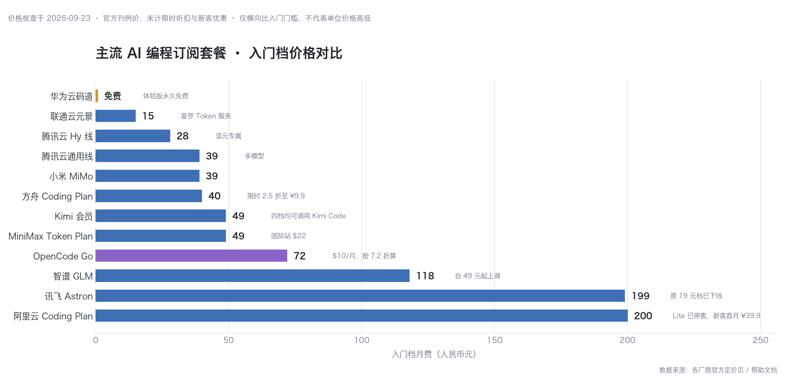
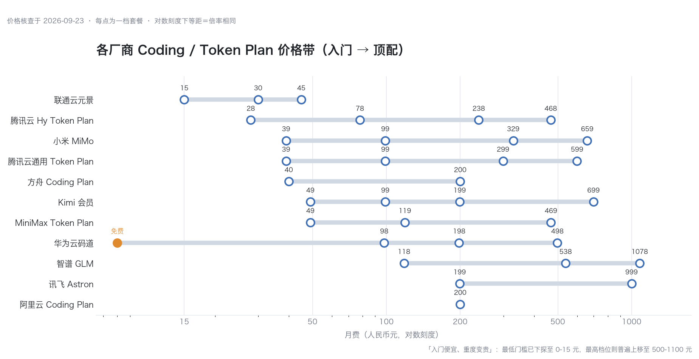

# 二、Coding Plan

[← 上一章：一、龙虾 Claw 产品系列](../chapter01/01-openclaw-ecosystem.md) | [返回总览](../index.md) | [下一章：三、三方模型（API） →](../chapter03/03-model-api.md)

Coding Plan 是各 AI 平台推出的编程模型订阅套餐，以低价月费提供高质量代码生成能力。

> ⚠️ 各厂商 Coding Plan 价格和模型覆盖范围变化极快，以下信息为 2026 年 5 月整理，仅供参考。建议点击链接查看最新定价。

## 主流 Coding Plan

| 套餐                                                                              | 厂商        | 价格               | 特点                                                                                                                  |
| ------------------------------------------------------------------------------- | --------- | ---------------- | ------------------------------------------------------------------------------------------------------------------- |
| **[方舟 Coding Plan](https://www.volcengine.com/activity/codingplan)**            | 字节 火山引擎   | 月费 40 元起         | 模型自由、工具不限；升级可解锁 [ArkClaw](https://console.volcengine.com/ark/region:ark+cn-beijing/experience/claw)，7×24 小时在线专属智能伙伴 |
| **[GLM Coding Plan](https://bigmodel.cn/glm-coding)**                           | 智谱 AI     | 月费 49 元起         | 3x Claude Pro 用量额度起，支持月/季/年订阅                                                                                       |
| **[Kimi Code Plan](https://www.kimi.com/code)**                                 | 月之暗面 Kimi | 月费 49 元起         | 仅限 Kimi 系列模型（最新 K2.6，CLI 中标识为 kimi-for-coding）                                                                     |
| **[MiniMax Token Plan](https://platform.minimax.io/subscribe/token-plan)**      | MiniMax   | 月费 10 美元起        | 仅限MiniMax系列模型（M2、M2.1、M2.5、最新M2.7等）                                                                                 |
| **[阿里云 Coding Plan](https://www.alibabacloud.com/zh/campaign/ai-scene-coding)** | 阿里云       | Lite / Pro 两档       | 支持 qwen3.5-plus、qwen3-max、qwen3-coder-plus、qwen3-coder-next，以及 kimi-k2.5、glm-5、MiniMax-M2.5 等第三方模型；兼容 Claude Code、Cursor、Cline、Codex、OpenClaw、OpenCode、Qwen Code、Kilo CLI 等 |
| **[腾讯云 Token Plan](https://cloud.tencent.com/act/pro/tokenplan)**              | 腾讯云       | 月费 28 元起          | 分 **Hy Token Plan**（混元专属，28 元起）和**通用 Token Plan**（39 元起）两条线，各分 Lite/Standard/Pro/Max 四档；覆盖 Tencent HY 2.0、Hy3 preview、Kimi-K2.5、GLM-5.1、MiniMax-M2.7 等，兼容 Claude Code、CodeBuddy、OpenCode、Cursor、Codex、OpenClaw 等 |

## Coding Plan 对比图




## Coding Plan 多维对比

| 维度 | 方舟 | GLM | Kimi | MiniMax | 阿里云 | 腾讯云 |
|------|------|-----|------|---------|--------|--------|
| 入门价格 | 40 元/月 | 49 元/月 | 49 元/月 | 10 美元/月 | Lite 档 | 28 元/月 |
| 模型自由度 | 多模型可选 | Claude + GLM | 仅 Kimi | 仅 MiniMax | 多模型 + 第三方 | 混元 + 第三方 |
| 工具兼容性 | 不限 | 主流 CLI/IDE | 主流 CLI/IDE | 主流 CLI/IDE | 最广（8+ 工具） | 广（6+ 工具） |
| 自有模型 | 豆包系列 | GLM 系列 | Kimi 系列 | MiniMax 系列 | Qwen 系列 | 混元系列 |
| 第三方模型 | 支持 | Claude Pro 额度 | 不支持 | 不支持 | kimi/glm/MiniMax | kimi/glm/MiniMax |
| 订阅灵活性 | 月付 | 月/季/年 | 月付 | 月付 | Lite/Pro 两档 | 4 档可选 |
| 中文优化 | 优 | 优 | 优 | 良 | 优 | 优 |
| 企业功能 | ArkClaw 7×24 | — | — | — | — | 企业 IM 集成 |

## 用户画像与选型

| 你是谁 | 推荐方案 | 理由 |
|--------|---------|------|
| **个人开发者，想最低成本入门** | 腾讯云 Hy Token Plan（28 元/月） | 国内最低价，混元模型中文能力扎实 |
| **Claude 生态用户** | GLM Coding Plan | 含 Claude Pro 额度，同时可用 GLM |
| **只用 Kimi / 坚持单模型** | Kimi Code Plan | 深度绑定 Kimi K2.6，体验一致 |
| **需要模型自由 + 工具不限** | 方舟 Coding Plan | 模型自由、工具不限，灵活性最高 |
| **多工具切换、追求兼容性** | 阿里云 Coding Plan Pro | 兼容 8+ 编程工具，第三方模型最全 |
| **预算充足，想要全覆盖** | 阿里云 Pro + 腾讯云通用 | 双平台互补，模型覆盖最广 |

## 选型路径

```
第一步：你主要用什么编程工具？
 ├── Claude Code / Cursor → 确认工具兼容性（阿里云、腾讯云最广）
 └── OpenClaw / 其他 → 大部分 Coding Plan 都兼容

第二步：你对模型有什么要求？
 ├── 必须用 Claude → GLM Coding Plan（含 Claude Pro 额度）
 ├── 只用国产模型 → 腾讯云 / 阿里云（第三方模型多）
 └── 单一模型够用 → Kimi / MiniMax / 方舟

第三步：预算？
 ├── < 40 元/月 → 腾讯云 Hy Token Plan（28 元起）
 ├── 40-50 元/月 → 方舟（40 元）/ GLM（49 元）/ Kimi（49 元）
 └── 不限 → 阿里云 Pro + 腾讯云通用双订阅
```

## Coding Plan 趋势

- 各家 Coding Plan 正从单一模型走向多模型聚合，阿里云、腾讯云已全面支持第三方模型
- 腾讯云率先拆分为"混元专属 + 通用多模型"两条 Token Plan 线，阿里云保留 Lite/Pro 分层
- 字节方舟、智谱、Kimi 仍以自有模型为主
- Coding Plan → Token Plan 的品牌过渡正在发生，腾讯云已全面使用 Token Plan 名称
- 价格持续下探：入门门槛已降至 28 元/月，预计下半年可能出现免费基础档

## 常见问题

**Q：Coding Plan 和直接调用 API 有什么区别？**
A：Coding Plan 是订阅制，月费固定，适合日常编程高频使用；API 按量计费，适合低频或批量调用。日常编程选 Coding Plan 更划算。

**Q：可以同时订阅多个 Coding Plan 吗？**
A：可以，但通常没必要。建议先选一个主力，需要特定模型时再补充。双订阅成本 80-100 元/月，与直接用 Claude Pro（20 美元/月）相当。

**Q：Coding Plan 的额度用完了怎么办？**
A：各厂商处理方式不同——有的自动降速，有的按量计费续用，有的直接停用。订阅前确认额度用尽后的策略。

## 相关文章

- [已知国内 LLM Coding Plan 订阅套餐整理 - 知乎](https://zhuanlan.zhihu.com/p/2006431542428315931)
- [AI Coding Plan 对比 - Coding Plan 对比工具](https://z4crk6mg95.coze.site/)
