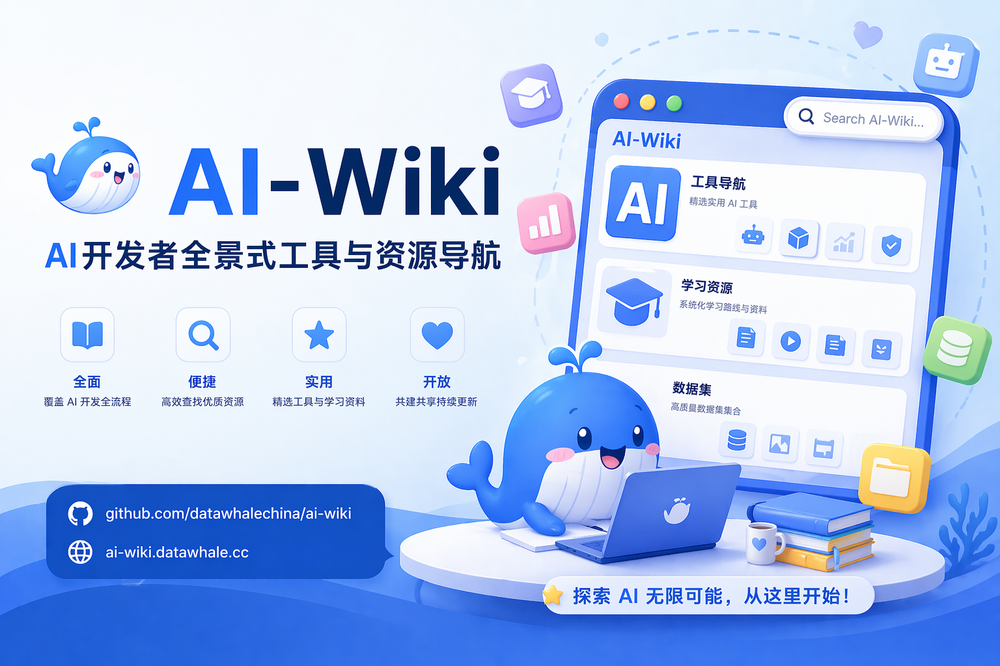

# AI-Wiki：总览目录

> ⭐ 如果觉得有用，欢迎 Star！[→ GitHub 仓库](https://github.com/datawhalechina/ai-wiki)



**更新时间**：2026-05-17
**贡献入口**：[提交 Issue](https://github.com/datawhalechina/ai-wiki/issues) / [提交 Pull Request](https://github.com/datawhalechina/ai-wiki/pulls)

本文档是 `ai-wiki` 的正文总览页。完整内容已按章节拆分在 `docs/chapterXX/` 目录下，便于持续维护与扩展图片等资源文件。

## 全景架构图

13 个章节可分为三层：**基础设施层 → 框架与协议层 → 应用与范式层**

```
┌─────────────────────────────────── 应用与范式层 ───────────────────────────────────┐
│                                                                                    │
│   Vibe Coding(12)          Skill(5)           Agent 框架(8)                        │
│   灵感/Spec/Glue/Harness   技能市场与创建      ReAct/Plan-Execute/多Agent            │
│                                                                                    │
├─────────────────────────────────── 框架与协议层 ───────────────────────────────────┤
│                                                                                    │
│   CLI(4)              MCP(6)              RAG(9)             IDE(7)                │
│   终端 Agent          工具调用协议          检索增强生成         AI 原生 IDE          │
│                                                                                    │
├─────────────────────────────────── 基础设施层 ───────────────────────────────────┤
│                                                                                    │
│   模型 API(3)     Embedding(11)    向量库(10)     Coding Plan(2)   Claw(1)         │
│   LLM 能力来源    文本→向量        向量存储与检索   订阅套餐         开源智能体       │
│                                                                                    │
└───────────────────────────────────────────────────────────────────────────────────┘
                                         │
                                  资源导航(13) + Prompt Engineering(14)
```

**依赖关系**：模型 API(3) 是所有上层的基础；Embedding(11) + 向量库(10) 是 RAG(9) 的前置；MCP(6) 是 Agent(8) 和 Skill(5) 的工具协议。

## 学习路径

根据你的目标，选择不同的学习路线：

### 路线 A：AI 编程入门（零基础）

适合想快速上手 AI 辅助编程的开发者。

```
模型 API(3) → CLI(4) → IDE(7) → Skill(5) → Vibe Coding(12) → Coding Plan(2)
  "有哪些模型"   "终端怎么用"  "IDE怎么选"  "技能怎么装"   "怎么用AI写代码"  "怎么省钱"
```

**目标**：能用 AI 工具独立完成一个小项目。

### 路线 B：RAG 应用开发者

适合想构建知识库问答、文档检索系统的开发者。

```
模型 API(3) → Embedding(11) → 向量库(10) → RAG 框架(9) → MCP(6)
  "选哪个模型"   "文本怎么变向量"  "向量存哪里"   "怎么检索+生成"  "怎么接外部工具"
```

**目标**：能搭建一个端到端的 RAG 知识库问答系统。

### 路线 C：Agent 工程师

适合想构建自主推理、多步执行的 AI Agent 的开发者。

```
MCP(6) → Agent 框架(8) → RAG(9) → Skill(5) → Prompt Engineering(14)
 "工具协议"  "框架怎么选"   "知识增强"  "技能封装"   "提示词工程"
```

**目标**：能设计并实现一个多步骤、可调用工具的 AI Agent。

## 阅读方式

- 从本页按主题跳转到对应章节
- 每个章节页都提供「上一章 / 返回总览 / 下一章」互链
- 或按上述学习路径顺序阅读

## 章节目录

| 章节 | 文件 | 简介 |
| --- | --- | --- |
| 一、龙虾 Claw 产品系列 | [`01-openclaw-ecosystem.md`](chapter01/01-openclaw-ecosystem.md) | OpenClaw 生态、核心能力与国内产品矩阵 |
| 二、Coding Plan | [`02-coding-plan.md`](chapter02/02-coding-plan.md) | 主流订阅套餐、定价与趋势 |
| 三、三方模型（API） | [`03-model-api.md`](chapter03/03-model-api.md) | 国际/国产 API 模型与聚合平台 |
| 四、CLI 种类 | [`04-cli-tools.md`](chapter04/04-cli-tools.md) | 主流 AI CLI 工具盘点 |
| 五、好用的 Skill | [`05-skills.md`](chapter05/05-skills.md) | Skill 生态和常见技能类型 |
| 六、MCP | [`06-mcp.md`](chapter06/06-mcp.md) | MCP 服务器、客户端与延伸阅读 |
| 七、编程工具 IDE | [`07-ide-tools.md`](chapter07/07-ide-tools.md) | IDE/编辑器与 Web 编程工具 |
| 八、Agent 框架 | [`08-agent-frameworks.md`](chapter08/08-agent-frameworks.md) | Agent 框架、低代码平台与对比 |
| 九、RAG 框架 | [`09-rag-frameworks.md`](chapter09/09-rag-frameworks.md) | 主流框架与演进方向 |
| 十、向量知识库 | [`10-vector-databases.md`](chapter10/10-vector-databases.md) | 向量数据库选型参考 |
| 十一、Embedding 模型 | [`11-embedding-models.md`](chapter11/11-embedding-models.md) | 主流 Embedding 模型与榜单 |
| 十二、Vibe Coding 四种 | [`12-vibe-coding.md`](chapter12/12-vibe-coding.md) | 开发者原型与编程范式 |
| 十三、资源导航 | [`13-resources.md`](chapter13/13-resources.md) | 导航站、榜单与社区资源 |
| 十四、Prompt Engineering | [`14-prompt-engineering.md`](chapter14/14-prompt-engineering.md) | 提示词核心技巧、框架与最佳实践 |
| 十五、端到端实战项目 | [`15-hands-on-projects.md`](chapter15/15-hands-on-projects.md) | RAG 知识库、MCP Server、Vibe Coding MVP |

## 术语表

| 术语 | 全称 | 含义 |
|------|------|------|
| **LLM** | Large Language Model | 大语言模型，如 GPT、Claude、Qwen |
| **RAG** | Retrieval-Augmented Generation | 检索增强生成，先检索相关文档再生成回答 |
| **MCP** | Model Context Protocol | 模型上下文协议，AI 应用的工具调用标准 |
| **Agent** | AI Agent | 能自主推理、规划、执行任务的 AI 系统 |
| **Embedding** | Text Embedding | 将文本转换为向量表示，用于语义检索 |
| **HNSW** | Hierarchical Navigable Small World | 基于图的向量索引算法，查询速度快 |
| **IVF** | Inverted File Index | 基于聚类的向量索引算法，适合大规模数据 |
| **MTEB** | Massive Text Embedding Benchmark | Embedding 模型的权威评测基准 |
| **CoT** | Chain of Thought | 思维链，让模型逐步推理以提升准确率 |
| **ReAct** | Reasoning + Acting | 推理+行动交替的 Agent 设计模式 |
| **Skill** | AI Skill | 为 AI 预定义的可复用专业能力包 |
| **CLI** | Command-Line Interface | 命令行界面，终端中使用的工具 |
| **IDE** | Integrated Development Environment | 集成开发环境，如 VS Code、Cursor |
| **BM25** | Best Matching 25 | 经典关键词检索算法，常与向量检索组合使用 |
| **RRF** | Reciprocal Rank Fusion | 倒数排名融合，合并多路检索结果的排序方法 |
